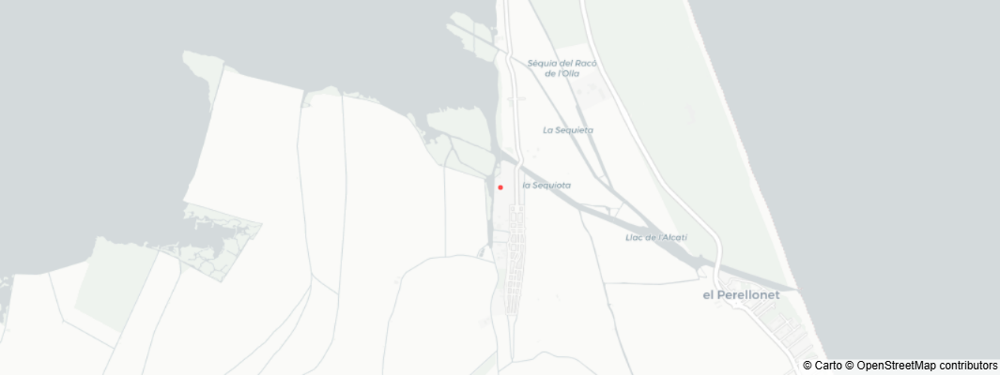

# 🌦️ Estación Meteorológica Parque Natural de la Albufera

Este repositorio contiene el código del dashboard interactivo (desarrollado con **Streamlit**, **InfluxDB** y **Plotly**) para visualizar en tiempo real los datos climatológicos recogidos en el Parque Natural>

El trabajo está dentro del proyecto AM-DS gestionado por el **Grupo de Redes de Computadores (GRC)** de la Universidad Politécnica de Valencia (UPV).

---

## 📡 El Hardware: SenseCAP S2120 LoRaWAN 8-in-1

Para la recogida de datos utilizamos la estación meteorológica **SenseCAP S2120**, un dispositivo industrial todo en uno diseñado para el monitoreo ambiental bajo condiciones climáticas severas.

### 📊 Sensores Integrados (8-en-1)
La estación mide simultáneamente los siguientes parámetros:
* **Temperatura del aire**
* **Humedad relativa**
* **Presión atmosférica**
* **Intensidad de la luz (Lux)**
* **Índice UV**
* **Velocidad del viento**
* **Dirección del viento** (360°)
* **Precipitación / Lluvia** (acumulada y tasas)

### 🚀 Conectividad y Arquitectura
* **Tecnología LoRaWAN:** Ultra bajo consumo con transmisión de largo alcance, ideal para entornos naturales como la Albufera donde no hay cobertura WiFi convencional.
* **Alimentación Sostenible:** Funciona mediante un panel solar integrado respaldado por baterías recubiertas de alta durabilidad, lo que garantiza una autonomía ininterrumpida.
* **Flujo de Datos:** El sensor envía los paquetes cifrados vía radio a un Gateway LoRaWAN cercano. Desde allí, los datos se parsean y se almacenan cronológicamente en nuestra base de datos **InfluxDB Cloud** para ser finalmente consumidos por este dashboard..

---

## 🛠️ Tecnologías del Dashboard
* **Python 3.10+**
* **Streamlit:** Para la interfaz web rápida e interactiva.
* **InfluxDB Client:** Conexión directa y consultas optimizadas mediante Flux.
* **Plotly:** Gráficos dinámicos, incluyendo mapas e histogramas polares para la rosa de los vientos.

